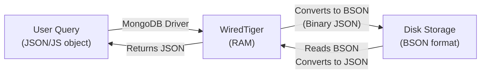

# MongoDB — Shell, Commands, BSON & ObjectId

## Table of Contents

1. [MongoDB Architecture — Driver & WiredTiger](#1-mongodb-architecture--driver--wiredtiger)
2. [MongoDB Shell (mongosh)](#2-mongodb-shell-mongosh)
3. [GUI vs CLI](#3-gui-vs-cli)
4. [MongoDB Server Management](#4-mongodb-server-management)
5. [MongoDB Connection URLs](#5-mongodb-connection-urls)
6. [Database-Level Commands](#6-database-level-commands)
7. [Collection-Level Commands](#7-collection-level-commands)
8. [CRUD Operations on Documents](#8-crud-operations-on-documents)
9. [BSON — Binary JSON](#9-bson--binary-json)
10. [ObjectId — Deep Dive](#10-objectid--deep-dive)
11. [Complete Command Reference](#11-complete-command-reference)
12. [Summary](#12-summary)
13. [Revision Checklist](#13-revision-checklist)

---

## 1. MongoDB Architecture — Driver & WiredTiger

### The Complete Architecture

```
┌─────────────────────────────────────────────────────────────────┐
│                      Database Layer                             │
│                                                                 │
│  ┌──────────────────────┐        ┌─────────────────────────┐    │
│  │  MongoDB Driver      │        │     WiredTiger          │    │
│  │                      │        │                         │    │
│  │  interface/shell     │───────►│  RAM                    │    │
│  │  → mongo shell       │        │                         │    │
│  │                      │◄───────│  MongoDB Storage Engine │    │
│  │  use library         │        │                         │    │
│  │  find()              │        │  1) Converts JSON/JS    │    │
│  │                      │        │     object to BSON      │    │
│  └──────────────────────┘        │                         │    │
│                                   │  2) Allocates disk     │    │
│  db.gameNames.insertOne({...})   │     space for new data  │    │
│  db.gameNames.insertOne({...})   │                         │    │
│                                   │  3) Fetches data from   │  │
│                                   │     disk (BSON → JSON)  │  │
│                                   └────────┬────────────────┘  │
│                                            │                   │
│                                            ▼                   │
│                                   ┌─────────────────────────┐  │
│                                   │   Disk Storage          │  │
│                                   │                         │  │
│                                   │   data (BSON format)    │  │
│                                   │   newData (BSON)        │  │
│                                   │                         │  │
│                                   └─────────────────────────┘  │
└────────────────────────────────────────────────────────────────┘
```

---

### MongoDB Driver

**What it is:** The MongoDB driver is the **interface/shell layer** that acts as a bridge between:

- The **user** (you typing commands)
- The **database** (WiredTiger storage engine)
- Your **Node.js application** (when using `mongoose` or `mongodb` npm package)

**Components:**

- **mongo shell (mongosh)** — Command-line interface for manual queries
- **Client libraries** — Node.js driver, Python driver, Java driver, etc.
- **Core methods** — `find()`, `insertOne()`, `updateMany()`, etc.

```javascript
// Example: Using MongoDB driver in Node.js
const { MongoClient } = require("mongodb");
const client = new MongoClient("mongodb://localhost:27017");

await client.connect();
const db = client.db("library");
const collection = db.collection("books");
const result = await collection.find({ year: 2020 }).toArray();
```

---

### WiredTiger Storage Engine

**What it is:** WiredTiger is the **default storage engine** in MongoDB (since version 3.2). It runs in **RAM** and is responsible for:

1. **Converting JSON/JavaScript objects to BSON** before writing to disk
2. **Converting BSON back to JSON** when reading from disk
3. **Allocating disk space** for new data
4. **Fetching data from disk** when queried
5. **Compression** — BSON is stored in compressed format to save space
6. **Caching** — Frequently accessed data stays in RAM for speed



---

### Why WiredTiger Uses BSON

| Benefit               | Explanation                                                                          |
| --------------------- | ------------------------------------------------------------------------------------ |
| **Faster processing** | Binary format is faster to parse than text JSON                                      |
| **More datatypes**    | Supports `undefined`, `Date`, `ObjectId`, `Binary`, `RegExp` — not available in JSON |
| **Efficient storage** | Compressed binary takes less disk space                                              |
| **Performance**       | Direct memory mapping, no need to parse text                                         |

---

### Flow Summary

```
1. User writes: db.books.insertOne({ name: "NFS", year: 2001, rating: 4.73 })
   ↓
2. MongoDB Driver receives the JavaScript object
   ↓
3. WiredTiger converts it to BSON (Binary JSON)
   ↓
4. BSON is written to disk storage
   ↓
5. When reading, WiredTiger fetches BSON from disk
   ↓
6. WiredTiger converts BSON back to JSON
   ↓
7. User receives the data as a JavaScript object
```

---

## 2. MongoDB Shell (mongosh)

### What is mongosh?

**Definition:** `mongosh` (MongoDB Shell) is a **CLI (Command-Line Interface)** built using JavaScript that acts as an **interactive interface** between the user and the MongoDB database.

Think of it as the **terminal for MongoDB** — like how you use `psql` for PostgreSQL or `mysql` for MySQL.

```
User ──[ mongosh ]──► MongoDB Database
```

---

### How to Enter mongosh

```bash
# Open terminal / command prompt
# Type:
mongosh

# You should see:
Current Mongosh Log ID: ...
Connecting to: mongodb://127.0.0.1:27017
Using MongoDB: 7.0.0
Using Mongosh: 2.0.0

test>   ← This is the prompt (default database is "test")
```

> **Default database:** When you first enter `mongosh`, you are automatically connected to the `test` database.

---

### Exiting mongosh

```bash
# Option 1: Type exit
test> exit

# Option 2: Press Ctrl + C
^C

# Option 3: Type quit
test> quit
```

---

## 3. GUI vs CLI

| Feature                | GUI (Compass)                       | CLI (mongosh)                                |
| ---------------------- | ----------------------------------- | -------------------------------------------- |
| **Full name**          | Graphical User Interface            | Command Line Interface                       |
| **Commands required?** | ❌ No — click buttons, fill forms   | ✅ Yes — type commands                       |
| **Ease of use**        | Easier for beginners                | Harder initially, faster once learned        |
| **Functionality**      | Limited to what's built into the UI | Full access to all MongoDB features          |
| **Speed**              | Slower (lots of clicking)           | Faster (type commands directly)              |
| **Automation**         | Cannot script or automate           | Can write scripts, automate tasks            |
| **Use case**           | Quick exploration, visual browsing  | Production work, scripting, advanced queries |

```
GUI (Compass):
  Click "Databases" → Click "library" → Click "books" → Click "Insert Document" → Fill form → Click "Insert"

CLI (mongosh):
  db.books.insertOne({ name: "Book Title", year: 2023 })
  (Done in one line)
```

> **Real-world:** Developers use **Compass for exploration** and **mongosh for actual work** (scripting, automation, production queries).

---

## 4. MongoDB Server Management

### Starting and Stopping MongoDB Server

> **Important:** MongoDB must be **running as a service** for mongosh or Compass to connect to it.

```bash
# Check MongoDB server status (Windows)
sc query mongodb

# Output shows:
# STATE: 4 RUNNING   ← Server is running
# STATE: 1 STOPPED   ← Server is stopped
```

---

### Windows — Start/Stop Commands

```bash
# Open Command Prompt AS ADMINISTRATOR (right-click → Run as administrator)

# Stop MongoDB server
net stop mongodb

# Start MongoDB server
net start mongodb
```

---

### macOS / Linux — Start/Stop Commands

```bash
# Start MongoDB server
sudo systemctl start mongod
# or (older systems)
sudo service mongod start

# Stop MongoDB server
sudo systemctl stop mongod
# or
sudo service mongod stop

# Check status
sudo systemctl status mongod
```

---

## 5. MongoDB Connection URLs

### Structure of a MongoDB URL

```
mongodb://host:port
```

| Part         | Example                    | Meaning                     |
| ------------ | -------------------------- | --------------------------- |
| **Protocol** | `mongodb://`               | MongoDB connection protocol |
| **Host**     | `localhost` or `127.0.0.1` | Where MongoDB is running    |
| **Port**     | `27017`                    | Default MongoDB port        |

---

### localhost vs 127.0.0.1

```javascript
// mongosh (shell)
mongodb://127.0.0.1:27017
// Uses IP address directly

// MongoDB Compass (GUI)
mongodb://localhost:27017
// Uses domain name (resolves to 127.0.0.1)
```

**What's the difference?**

| Term        | Type            | Meaning                                                |
| ----------- | --------------- | ------------------------------------------------------ |
| `127.0.0.1` | **IP Address**  | The numeric address — always refers to "this computer" |
| `localhost` | **Domain Name** | A human-readable name that **resolves to** 127.0.0.1   |

> **Note:** They both mean the **same thing** — your local machine. `localhost` is just more human-friendly.

---

## 6. Database-Level Commands

### Default Database

When you enter `mongosh`, you start in the **`test`** database by default.

```bash
test>   ← You are in the "test" database
```

---

### 6.1 Show All Databases

```javascript
// Both commands do the same thing
show databases
show dbs

// Output:
admin    40.00 KiB
config   12.00 KiB
local    40.00 KiB
library  8.00 KiB
```

> **Note:** A database only appears in this list if it has at least **one collection with data**.

---

### 6.2 Create or Switch to a Database

```javascript
use database-name

// Examples:
use library   // If "library" exists → switch to it
              // If "library" doesn't exist → create it (but it's empty)
```

**Important:** A new database is **not saved to disk** until you:

1. Create a collection inside it, OR
2. Insert a document into a collection

```javascript
use myNewDB    // Database created in memory (not on disk yet)
show dbs       // myNewDB is NOT listed yet

db.createCollection("users")  // NOW it's saved to disk
show dbs       // myNewDB appears in the list
```

---

### 6.3 Create a Collection

```javascript
db.createCollection("collection-name");

// Example:
db.createCollection("books");

// Output:
{
  ok: 1;
}
```

> **Remember:** After running any command in mongosh, **refresh MongoDB Compass** to see the updates visually.

---

### 6.4 Show All Collections

```javascript
// Both commands do the same thing
show collections
show tables

// Output:
books
authors
reviews
```

---

### 6.5 Delete a Collection

```javascript
db.collectionName.drop()

// Example:
db.books.drop()

// Output:
true   ← Collection deleted successfully
```

---

### 6.6 Rename a Collection

```javascript
db.collectionName.renameCollection("newName");

// Example:
db.books.renameCollection("novels");

// Output:
{
  ok: 1;
}
// "books" is now called "novels"
```

---

### 6.7 Delete a Database

```javascript
// First, switch to the database you want to delete
use library

// Then delete it
db.dropDatabase()

// Output:
{ ok: 1, dropped: 'library' }
```

> **Warning:** This **permanently deletes** the database and all its collections. There's no undo.

---

### 6.8 Renaming a Database — NOT POSSIBLE

> **Critical:** MongoDB does **NOT** have a command to rename a database. If you need to rename it, you must:
>
> 1. Create a new database with the new name
> 2. Copy all collections to the new database
> 3. Delete the old database

---

## 7. Collection-Level Commands

### Summary Table

| Task                 | Command                          | Example                                 |
| -------------------- | -------------------------------- | --------------------------------------- |
| Create collection    | `db.createCollection("name")`    | `db.createCollection("users")`          |
| Show all collections | `show collections`               | `show tables`                           |
| Drop collection      | `db.collection.drop()`           | `db.users.drop()`                       |
| Rename collection    | `db.old.renameCollection("new")` | `db.users.renameCollection("accounts")` |

---

## 8. CRUD Operations on Documents

### 8.1 Inserting a Single Document

```javascript
db.collectionName.insertOne({ key: value, ... })

// Example:
db.gameNames.insertOne({
    name: "Call of Duty",
    year: 1996,
    rating: 4.73
})

// Output:
{
  acknowledged: true,
  insertedId: ObjectId("69959910aba5099b6c73518a")
}
```

```javascript
// Another example:
db.gameNames.insertOne({
    name: "NFS",
    year: 2001,
    rating: 4.73
})

// Output:
{
  acknowledged: true,
  insertedId: ObjectId("69959910aba5099b6c73518b")
}
```

> **Note:** MongoDB automatically adds an `_id` field with a unique ObjectId if you don't provide one.

---

### 8.2 Finding Documents

```javascript
// Find all documents
db.collectionName.find();

// Find with a filter
db.gameNames.find({ year: 2001 });

// Find one document
db.gameNames.findOne({ name: "NFS" });
```

---

## 9. BSON — Binary JSON

### What is BSON?

**Definition:** BSON stands for **Binary JSON**. It is a **binary representation of JSON** — a format that MongoDB uses internally to store documents on disk.

```
JSON (Text)  ──[ WiredTiger ]──►  BSON (Binary)  ──►  Disk Storage
      ▲                                                        │
      └────────────────────────────────────────────────────────┘
                          (Read back)
```

---

### BSON vs JSON — Key Differences

| Feature             | JSON                                         | BSON                                                                                                    |
| ------------------- | -------------------------------------------- | ------------------------------------------------------------------------------------------------------- |
| **Format**          | Text (human-readable)                        | Binary (machine-readable)                                                                               |
| **Size**            | Larger (text overhead)                       | Smaller (compressed binary)                                                                             |
| **Speed**           | Slower to parse                              | Faster to parse                                                                                         |
| **Human readable**  | ✅ Yes                                       | ❌ No                                                                                                   |
| **Supported types** | string, number, boolean, null, array, object | All JSON types PLUS: `Date`, `ObjectId`, `Binary`, `RegExp`, `undefined`, `int32`, `int64`, `Timestamp` |

---

### Extra Datatypes in BSON

```javascript
// These are allowed in MongoDB (BSON) but NOT in standard JSON:

{
  _id: ObjectId("507f1f77bcf86cd799439011"),  // ObjectId — unique identifier
  name: "Alice",
  age: 30,
  birthdate: ISODate("1994-01-15T00:00:00Z"), // Date object
  profilePic: BinData(0, "..."),              // Binary data (images, files)
  pattern: /abc/i,                            // RegExp
  bonus: undefined,                           // undefined
  metadata: null                              // null (also in JSON)
}
```

---

### Why MongoDB Uses BSON

1. **Performance** — Binary format is much faster to encode/decode than text JSON
2. **Rich datatypes** — Supports `Date`, `ObjectId`, `Binary`, etc.
3. **Efficient storage** — Compressed binary takes less disk space
4. **Traversability** — BSON includes length information, making it easy to skip fields without parsing the entire document

> **Real-world analogy:** JSON is like a handwritten letter (human-readable). BSON is like a compressed ZIP file (machine-efficient but not human-readable).

---

## 10. ObjectId — Deep Dive

### What is ObjectId?

**Definition:** `ObjectId` is a **12-byte unique identifier** automatically generated by MongoDB for every document's `_id` field (unless you manually provide one).

```javascript
_id: ObjectId("69959910aba5099b6c73518a");
```

---

### ObjectId Structure — 12 Bytes (96 bits)

```
ObjectId("69959910aba5099b6c73518a")
         └─────┬─────┘└──┬──┘└─┬──┘
          4 bytes   5 bytes 3 bytes
         Timestamp   PUI    Counter
```

| Part          | Size                        | Purpose                                                                     |
| ------------- | --------------------------- | --------------------------------------------------------------------------- |
| **Timestamp** | 4 bytes (first 8 hex chars) | Seconds since Unix Epoch (Jan 1, 1970)                                      |
| **PUI**       | 5 bytes (next 10 hex chars) | Process Unique Identifier (combination of machine ID + process ID)          |
| **Counter**   | 3 bytes (last 6 hex chars)  | Incremental counter (starts with random value, increments by 1 each insert) |

---

### Breaking Down an Example

```javascript
_id: ObjectId("69959910aba5099b6c73518a")

// Part 1: Timestamp (first 4 bytes → 8 hex characters)
"69959910"  → Represents the timestamp (seconds since Jan 1, 1970)

// Part 2: PUI (next 5 bytes → 10 hex characters)
"aba5099b6c"  → Process Unique Identifier (machine ID + process ID)

// Part 3: Counter (last 3 bytes → 6 hex characters)
"73518a"  → Incremental counter (starts random, increments by 1)
```

---

### Key Properties of ObjectId

| Property             | Detail                                                                    |
| -------------------- | ------------------------------------------------------------------------- |
| **Uniqueness**       | No two documents can have the same `_id` — guaranteed globally unique     |
| **Auto-generated**   | MongoDB automatically creates it if you don't provide `_id`               |
| **Immutable**        | Once created, you **cannot change** the `_id` (both key and value)        |
| **12 bytes**         | Total size: 12 bytes = 96 bits = 24 hexadecimal characters                |
| **Hexadecimal**      | Uses 0-9 and a-f (16 possible values per character)                       |
| **Sortable by time** | Documents with older ObjectIds were inserted earlier (timestamp is first) |

---

### Can You Provide Your Own `_id`?

✅ **Yes!** If you manually provide an `_id` when inserting, MongoDB will **not auto-generate** one.

```javascript
// MongoDB auto-generates _id
db.users.insertOne({ name: "Alice", age: 30 });
// Result: { _id: ObjectId("..."), name: "Alice", age: 30 }

// You provide _id manually
db.users.insertOne({ _id: 123, name: "Bob", age: 25 });
// Result: { _id: 123, name: "Bob", age: 25 }

db.users.insertOne({ _id: "custom-id-abc", name: "Charlie", age: 28 });
// Result: { _id: "custom-id-abc", name: "Charlie", age: 28 }
```

> **Warning:** If you provide a custom `_id`, **you are responsible** for ensuring it's unique. Duplicate `_id` will cause an error.

---

### Why ObjectId is Immutable

```javascript
// ❌ You CANNOT change _id after insertion
db.users.updateOne(
  { _id: ObjectId("69959910aba5099b6c73518a") },
  { $set: { _id: ObjectId("newid12345") } },
);
// Error: Performing an update on the path '_id' would modify the immutable field '_id'

// ❌ You also cannot rename the _id field
db.users.updateOne(
  { _id: ObjectId("69959910aba5099b6c73518a") },
  { $rename: { _id: "userId" } },
);
// Error: The _id field cannot be renamed
```

---

### Extracting the Timestamp from ObjectId

```javascript
// Get the timestamp from an ObjectId
const id = ObjectId("69959910aba5099b6c73518a");
const timestamp = id.getTimestamp();

console.log(timestamp);
// Output: 2025-02-15T10:30:00.000Z (example)
```

> **Use case:** You can use this to find **when a document was created** without storing a separate `createdAt` field.

---

## 11. Complete Command Reference

### Database Commands

| Command             | Purpose                   | Example             |
| ------------------- | ------------------------- | ------------------- |
| `show dbs`          | List all databases        | `show dbs`          |
| `use dbName`        | Create/switch to database | `use library`       |
| `db.dropDatabase()` | Delete current database   | `db.dropDatabase()` |

### Collection Commands

| Command                           | Purpose              | Example                               |
| --------------------------------- | -------------------- | ------------------------------------- |
| `db.createCollection("name")`     | Create collection    | `db.createCollection("books")`        |
| `show collections`                | List all collections | `show collections`                    |
| `db.coll.drop()`                  | Delete collection    | `db.books.drop()`                     |
| `db.coll.renameCollection("new")` | Rename collection    | `db.books.renameCollection("novels")` |

### Document Commands (CRUD)

| Command                            | Purpose                | Example                                               |
| ---------------------------------- | ---------------------- | ----------------------------------------------------- |
| `db.coll.insertOne({})`            | Insert single document | `db.users.insertOne({name:"Alice"})`                  |
| `db.coll.find()`                   | Find all documents     | `db.users.find()`                                     |
| `db.coll.findOne({})`              | Find one document      | `db.users.findOne({name:"Alice"})`                    |
| `db.coll.updateOne({}, {$set:{}})` | Update single document | `db.users.updateOne({name:"Alice"}, {$set:{age:31}})` |
| `db.coll.deleteOne({})`            | Delete single document | `db.users.deleteOne({name:"Alice"})`                  |

---

## 12. Summary

| Concept                    | Key Point                                                        |
| -------------------------- | ---------------------------------------------------------------- |
| **MongoDB Driver**         | Interface between user/app and database                          |
| **WiredTiger**             | Storage engine that converts JSON↔BSON, manages disk I/O         |
| **mongosh**                | CLI built with JavaScript to interact with MongoDB               |
| **GUI vs CLI**             | Compass = easy/visual, mongosh = powerful/scriptable             |
| **Connection URL**         | `mongodb://localhost:27017` or `mongodb://127.0.0.1:27017`       |
| **Default database**       | `test`                                                           |
| **Database persistence**   | Only saved to disk after creating a collection or inserting data |
| **Cannot rename database** | Must manually copy collections to new DB and delete old one      |
| **BSON**                   | Binary JSON — faster, smaller, supports more types               |
| **ObjectId**               | 12-byte unique ID (4B timestamp + 5B PUI + 3B counter)           |
| **\_id immutability**      | Cannot change `_id` after document is created                    |

---

## 13. Revision Checklist

### Architecture

- [ ] Can you explain the MongoDB Driver and what it does?
- [ ] Can you explain WiredTiger and its role (JSON↔BSON conversion, disk I/O)?
- [ ] Can you trace the flow: User → Driver → WiredTiger → Disk?

### Shell & Server

- [ ] Can you enter and exit mongosh?
- [ ] Can you start and stop the MongoDB server (Windows: `net start/stop mongodb`)?
- [ ] Can you check MongoDB server status (`sc query mongodb`)?
- [ ] Do you know the default database when entering mongosh (`test`)?

### GUI vs CLI

- [ ] Can you list 3 differences between Compass (GUI) and mongosh (CLI)?
- [ ] Do you know when to use each (exploration vs production work)?

### Connection URLs

- [ ] Can you break down `mongodb://localhost:27017`?
- [ ] Do you know the difference between `localhost` and `127.0.0.1`?

### Database Commands

- [ ] Can you list all databases (`show dbs`)?
- [ ] Can you create or switch to a database (`use library`)?
- [ ] Do you know when a database is saved to disk (after collection creation or data insert)?
- [ ] Can you delete a database (`db.dropDatabase()`)?
- [ ] Do you know that renaming a database is NOT possible?

### Collection Commands

- [ ] Can you create a collection (`db.createCollection("books")`)?
- [ ] Can you show all collections (`show collections`)?
- [ ] Can you drop a collection (`db.books.drop()`)?
- [ ] Can you rename a collection (`db.books.renameCollection("novels")`)?

### Document Operations

- [ ] Can you insert a single document (`db.coll.insertOne({})`)?
- [ ] Can you find all documents (`db.coll.find()`)?
- [ ] Can you find one document (`db.coll.findOne({})`)?

### BSON

- [ ] Can you explain what BSON is (Binary JSON)?
- [ ] Can you list 3 differences between JSON and BSON?
- [ ] Can you name 3 extra datatypes in BSON (ObjectId, Date, Binary)?
- [ ] Do you know why MongoDB uses BSON (performance, rich types, efficiency)?

### ObjectId

- [ ] Can you explain what ObjectId is (12-byte unique identifier)?
- [ ] Can you break down the 3 parts of ObjectId (4B timestamp + 5B PUI + 3B counter)?
- [ ] Do you know that `_id` is auto-generated if not provided?
- [ ] Do you know that `_id` is immutable (cannot be changed)?
- [ ] Can you provide a custom `_id` when inserting?
- [ ] Can you extract the timestamp from an ObjectId (`id.getTimestamp()`)?

---

> **Interview tip:** When asked "What is the difference between JSON and BSON?", say: _"JSON is a text-based format that's human-readable and language-independent, used for data exchange. BSON is a binary representation of JSON used internally by MongoDB for storage. BSON is faster to parse, takes less disk space, and supports additional datatypes like ObjectId, Date, Binary, and undefined that standard JSON doesn't have. MongoDB's WiredTiger storage engine converts your JSON documents to BSON before writing to disk, and converts them back to JSON when reading."_
